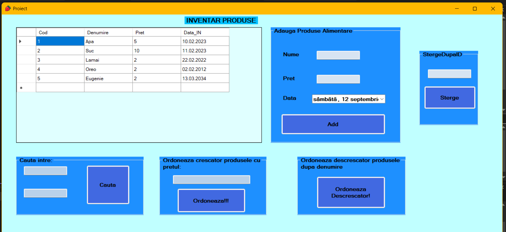

# Product Inventory Manager

A desktop product inventory management application developed in C# using Windows Forms and SQL Server LocalDB.

The application allows users to manage a simple product inventory, including adding and deleting products, filtering products by price range and sorting inventory data.

## Features

- Display products stored in a SQL Server database
- Add new products
- Delete products by ID
- Search products within a selected price range
- Sort products by price in ascending order
- Sort products by name in descending order
- Store product information including:
  - ID
  - Product name
  - Price
  - Date added

## Technologies

- C#
- .NET Framework 4.7.2
- Windows Forms
- SQL Server LocalDB
- Typed DataSet
- Visual Studio

## Database

The application uses a local SQL Server database:

`Proiect_Date.mdf`

The database is connected using `|DataDirectory|`, allowing the application to access the database using a relative path instead of a machine-specific path.

## Project Structure

- `Form1.cs` – application logic and event handling
- `Form1.Designer.cs` – Windows Forms user interface definition
- `Program.cs` – application entry point
- `App.config` – application and database connection configuration
- `Proiect_Date.mdf` – SQL Server database
- `Proiect_DateDataSet.xsd` – typed DataSet definition

## Screenshot

## What I Learned

This project helped me practice:

- C# desktop application development
- Windows Forms
- Working with SQL Server databases
- Connecting a graphical interface to a database
- Adding and deleting database records
- Filtering and sorting data
- Working with DataGridView controls
- Using typed DataSets in .NET
